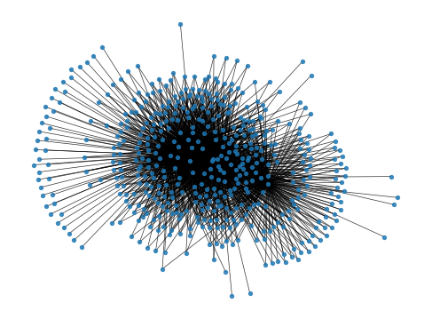
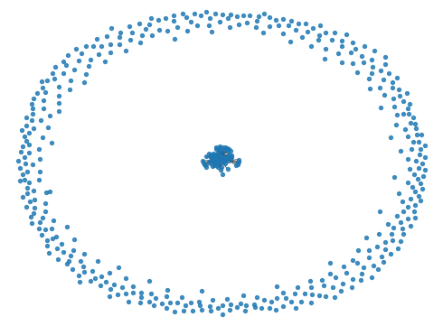

- [Deno Use](#deno-use)
- [Binance API Use](#binance-api-use)
- [Other References](#other-references)
- [Notes](#notes)
  - [What is a bi-directional graph?](#what-is-a-bi-directional-graph)
- [Questions](#questions)
- [Analysis](#analysis)
  - [Jupyter](#jupyter)
  - [Currency Neighbors](#currency-neighbors)
  - [BTC neighbors](#btc-neighbors)
  - [NonNeighbors](#nonneighbors)
  - [Largest Clique](#largest-clique)
  - [Remaining Currencies](#remaining-currencies)
- [Triplets](#triplets)
  - [29/01/22](#290122)
  - [31/01/22](#310122)
  - [02/08/22](#020822)
- [TODO](#todo)
  - [01/31/22](#013122)
  - [01/24/22](#012422)
  - [02/10/22](#021022)
    - [Preprocessing](#preprocessing)

### Deno Use

Reload flag if library is updated:

```
deno run --allow-write --allow-net --reload  record_high.ts
```

To import modules from the Deno REPL, use:

```ts
let api;
import("./req.ts").then((r) => (api = r));
```

When getting the output of `getExchangeRate` remember to use `await`:

```ts
const data: object = await api.getExchangeRate(currency);
```

Deno REPL set up:

```ts
let api;
import("./req.ts").then((r) => (api = r));
let ext;
import("./extraFunctions.ts").then((r) => (ext = r));

let mc;
import("./maxClique.ts").then((r) => (mc = r));

// get exchange rates
let exchange_rates = await api.getExchangeRate();

// get list with trades and bases/quotes
let info = await api.getExchangeInfo();

let data = await ext.getCompleteExchangeList(exchange_rates, info);

let network = ext.createNet(data);

let tp_lst = ext.tripletProfits(network);

ext.sortTriplets(tp_lst);

let tp_pr = ext.profitMarginTriplets(tp_lst, 0.01);

tp_pr[0];
tp_pr[tp_pr.length - 1];

let wgh = tp_lst.map(({ weight }) => weight);
wgh.sort()[0];
wgh.sort()[wgh.length - 1];

let high = { weight: 0, index: 0 };

tp_lst.forEach((tp) => {
  if (tp.weight > high.weight) {
    high.weight = tp.weight;
    high.index = tp.index;
  }
});

const highest_tp = tp_lst[high.index];

tp_lst.sort((a, b) => (a.weight > b.weight ? 1 : -1));
```

### Binance API Use

Reference [Binance documentation](https://github.com/binance/binance-spot-api-docs/blob/master/rest-api.md#symbol-price-ticker).
Use symbol price ticker.
The rate limit is 10 requests per second.

### Other References

Deno [write and read text file](https://medium.com/deno-the-complete-reference/read-write-json-files-in-deno-ca23073c4d76)
[Import into Deno REPL](https://stackoverflow.com/questions/63402664/how-to-import-a-module-inside-the-deno-repl)

### Notes

The binance API does not seem to have a rime or reason for the order of currency pairings.
It makes sense, for instance, to only provide `ETHBTC` but not `BTCETH`, what I don't know is why one is chosen in favor of the other.
Initially, we will be exploring the shape of the graph. Since our graphs will have no singletons, we don't need a set for vertices. All the information necessary for exploration will be in the set of edges.
Any useful graph we make will most likely be connected.
Not all currencies have three letter abbreviations.

#### What is a bi-directional graph?

Cryptocurrency exchange networks are bi-directional graphs because if you can trade currency A by B, you can also trade B by A.
Say the weight of the vertice that connects A and B in the direction A to B is given by >). The weight of the same vertice going from B to A would be =f(w(A,B))>).

### Questions

_What percentage of trades do we expect to be profitable?_

_What should be the selection criteria for the vertices in the graph?_

- Get a graph A from the neighborhood of a big currency such as BTC, then create a graph from the neighborhood of A.

### Analysis

#### Jupyter

Code used in Jupyter to get image of network:

```python
import pandas as pd
import networkx as nx
import matplotlib.pyplot as plt
import csv


def make_label_dict(labels):
    l = {}
    for i, label in enumerate(labels):
        l[i] = label
    return l

file_name = 'networkMatrix.csv'
input_data = pd.read_csv(file_name, index_col=0)
G = nx.Graph(input_data.values)

with open(file_name, 'r') as f:
    d_reader = csv.DictReader(f)
    headers = d_reader.fieldnames

#print headers

labels=make_label_dict(headers)
#print labels

edge_labels = dict( ((u, v), d["weight"]) for u, v, d in G.edges(data=True) )
# pos = nx.kamada_kawai_layout(G)
pos = nx.spring_layout(G)
# options = {"edgecolors": "tab:gray", "node_size": 80, "alpha": 0.9}
# nx.draw_networkx_nodes(G, pos, node_color="tab:red", **options)
nx.draw_networkx_nodes(G, pos, node_size = 8, alpha = .8)
nx.draw_networkx_edges(G, pos, alpha = .8, width = .5)
plt.show()
```

This will yield:



The nodes pushed away in the periphery are strong contenders for the independet set. It seems likely that is possible to easily turn the network into a split graph.

#### Currency Neighbors

The following code will return the number of neighbors for any given currency:

```js
// list of currency neighbors, where CUR is the string code for a currency (ex. 'BTC')
let cur_n = data.exchangeList.filter((e) => e.base === CUR || e.quote === CUR);
// currencies that are not neighbors of CUR
data.currency.filter(
  (c) => !cur_n.filter((n) => n.base === c || n.quote === c).length
);
```

#### BTC neighbors

As of 12/23, BTC has 405 neighbors. These are the 79 currencies with no edges to BTC:

```
[
  "USDSB",   "BGBP",      "TUSDB",     "BULL",    "BEAR",
  "ETHBULL", "ETHBEAR",   "EOSBULL",   "EOSBEAR", "XRPBULL",
  "XRPBEAR", "BNBBULL",   "BNBBEAR",   "BTCUP",   "BTCDOWN",
  "IQ",      "ETHUP",     "ETHDOWN",   "ADAUP",   "ADADOWN",
  "LINKUP",  "LINKDOWN",  "VTHO",      "BNBUP",   "BNBDOWN",
  "XTZUP",   "XTZDOWN",   "EOSUP",     "EOSDOWN", "TRXUP",
  "TRXDOWN", "XRPUP",     "XRPDOWN",   "DOTUP",   "DOTDOWN",
  "SWRV",    "LTCUP",     "LTCDOWN",   "CREAM",   "BURGER",
  "SPARTA",  "UNIUP",     "UNIDOWN",   "SXPUP",   "SXPDOWN",
  "FILUP",   "FILDOWN",   "YFIUP",     "YFIDOWN", "BCHUP",
  "BCHDOWN", "KP3R",      "SLP",       "CVP",     "BCHA",
  "HEGIC",   "AAVEUP",    "AAVEDOWN",  "COVER",   "GHST",
  "SUSHIUP", "SUSHIDOWN", "XLMUP",     "XLMDOWN", "DF",
  "DEXE",    "BETH",      "PROS",      "UFT",     "BIFI",
  "PUNDIX",  "1INCHUP",   "1INCHDOWN", "SHIB",    "MASK",
  "ERN",     "XEC",       "RAY",       "BVND"
]
```

These might all be "special" currencies. BTCUP and BTCDOWN, for instance, are Binance's ["Leveraged Tokens"](https://www.binance.com/en/support/faq/360042957472).

#### NonNeighbors

12/25, one currency has been added to the list of BTC's non neighbors:

```js
> ext.getNonNeighbors(data,'BTC').length
80
> ext.getNonNeighbors(data,'BTC')
[
  "USDSB",   "BGBP",      "TUSDB",     "BULL",    "BEAR",
  "ETHBULL", "ETHBEAR",   "EOSBULL",   "EOSBEAR", "XRPBULL",
  "XRPBEAR", "BNBBULL",   "BNBBEAR",   "BTCUP",   "BTCDOWN",
  "IQ",      "ETHUP",     "ETHDOWN",   "ADAUP",   "ADADOWN",
  "LINKUP",  "LINKDOWN",  "VTHO",      "BNBUP",   "BNBDOWN",
  "XTZUP",   "XTZDOWN",   "EOSUP",     "EOSDOWN", "TRXUP",
  "TRXDOWN", "XRPUP",     "XRPDOWN",   "DOTUP",   "DOTDOWN",
  "SWRV",    "LTCUP",     "LTCDOWN",   "CREAM",   "BURGER",
  "SPARTA",  "UNIUP",     "UNIDOWN",   "SXPUP",   "SXPDOWN",
  "FILUP",   "FILDOWN",   "YFIUP",     "YFIDOWN", "BCHUP",
  "BCHDOWN", "KP3R",      "SLP",       "CVP",     "BCHA",
  "HEGIC",   "AAVEUP",    "AAVEDOWN",  "COVER",   "GHST",
  "SUSHIUP", "SUSHIDOWN", "XLMUP",     "XLMDOWN", "DF",
  "DEXE",    "BETH",      "PROS",      "UFT",     "BIFI",
  "PUNDIX",  "1INCHUP",   "1INCHDOWN", "SHIB",    "MASK",
  "ERN",     "XEC",       "RAY",       "OOKI",    "BVND"
]
> ext.getNeighbors(data,'OOKI')
[
  { symbol: "OOKIBUSD", base: "OOKI", quote: "BUSD", price: "0.04750000" },
  { symbol: "OOKIUSDT", base: "OOKI", quote: "USDT", price: "0.04748000" }
]
```

OOKI's only neighbors are BUSD and USDT.

#### Largest Clique

As of 01/19/22, the largest clique in the graph is:

```
[
  "ETH",  "BNB",
  "BTC",  "TRX",
  "XRP",  "TUSD",
  "PAX",  "USDC",
  "BUSD", "USDT"
]
```

When these currencies are removed, the remaining network still has 184 edges. There are 80 currencies that still associate with an edge.

It is possible to get them with the following line:

```ts
let c_set = new Set([
  ...data_no_clique.exchangeList.map((e) => e.base),
  ...data_no_clique.exchangeList.map((e) => e.quote),
]);
```

Here is what the network looks like now:



#### Remaining Currencies

Here is a comparison between non-neighbors of BTC and the remaining currencies after the largest clique is removed:

```
[
  { has: true, currency: "USDSB" },
  { has: true, currency: "SLP" },
  { has: true, currency: "SHIB" },
]
```

### Triplets

We check the triplets in 2-core decomposition of the graph. The 2-core is used because 1-degree vertices do not participate in any triplets.
Code to check number of sum in python:

```python
sum(nx.triangles(G).values())
```

#### 29/01/22

BNB participates exactly in a tenth of the trades.

The `createNet()` function returns a network with sorted edges.
It makes sure every `from > to`, and changes the weight of the edge to `1/price` when necessary.
`tripletProfits()` returns a list with the triplets and the triplet's product-weight (the product of its edge weights).

The top triplet (with the highest weight) is

```json
{ "triplet": ["BNB", "USDT", "VEN"], "weight": 580835.6, "index": 1432 }
```

But VEN is a dead currency, and not trade in binance as far as I know. It has been substituted by VET.

The top viable triplet is actually:

```json
{
  "triplet": ["BTC", "BUSD", "SUN"],
  "weight": 1866.312365450792,
  "index": 4719
}
```

#### 31/01/22

JSON of triplets can be found in `triplets_31_0_2022.json`

#### 02/08/22

Removed all untradable currencies.
Current network configuration:

```ts
> network.edges.size
1386
> network.vertices.size
345
```

Also applied fees.
The most profitable trade is now BTC, SPELL, USDT, with 4.6% profits.

Triplets with at least 1% profit:

```ts
> let tp_pr = ext.profitMarginTriplets(tp_lst, 0.01);
undefined
> tp_pr.length
155
> tp_lst.length
2478
> tp_lst[0]
{ triplet: [ "BTC", "BUSD", "SPELL" ], weight: 0.9566398322580645, index: 2370 }
> tp_lst[tp_lst.length-1]
{ triplet: [ "BTC", "SPELL", "USDT" ], weight: 1.0463119365658742, index: 2368 }
> 1/tp_lst[0].weight
1.045325488527472
```

2499

### TODO

- [x] Show graph
- [x] Get all coins
- [x] MaxClique algorithm
- check if nodes in other set are independent
- reference: https://www.geeksforgeeks.org/maximal-clique-problem-recursive-solution/
  set of candidates for independent set if its not zero
- how many edges
- if there are many edges what

#### 01/31/22

- maximum trade value limit

#### 01/24/22

- [x] percentage profitable
- [x] incorporate trading fees

#### 02/10/22

- [ ] market cap
- [ ] what coins show up in most triplets
- [ ] how long the windows stay open for
- [ ] sec by sec triplets algorithm
- [ ] analyze what triplets look like
- [ ] also register all exchange rates

##### Preprocessing

- [ ] remove degree 1 vertices (leaves)
- [ ] contract edges incident to a degree 2 vertex
  - [ ] add contracted property
- [ ] delete cut edges (edges connecting 2 graph components)
- [ ] separate components of cut vertices

Only add edge if vertices are in increasing order.

- how quickly weights updates
- how often a positive weight happens in a day
- calculate fluctuations
- how many triangles, how often oportunities happen

```
for i=1:m  //for every edge
for j=1:n //for every vertex
if endpoint1 of edge i and endpoint2 of edge i have j as a neighbor
add {endpoint1 of edge i, endpoint2 of edge i, j} to triangle_list
end
end
end
// 4 cycles
for i=1:m  //for every edge (u,v)
for w=1:N(v)\{u}
for j=1:n //for every vertex except v
if u and w have j as a neighbor
add {u,v,w,j} to C4_list
end
end
end
end

```

-
