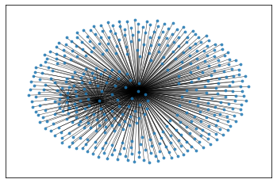
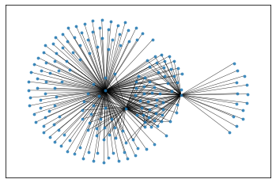

- [REPL data analysis](#repl-data-analysis)
- [03/01](#0301)
- [03/03](#0303)
- [API exporations](#api-exporations)
  - [Coinbase](#coinbase)
  - [Gemini](#gemini)
  - [Kraken](#kraken)
  - [FTX](#ftx)
  - [Crypto.com](#cryptocom)

The Python code for visualizing the network can be found in [the graphVis file](graphVis.py).

### REPL data analysis

```ts
// importing functions
let api;
import("./req.ts").then((r) => (api = r));
let ext;
import("./extraFunctions.ts").then((r) => (ext = r));

// get exchange rates
let exchange_rates = await api.getExchangeRate();

// get list with trades and bases/quotes
let info = await api.getExchangeInfo();

// get parsed data
let data = await ext.getCompleteExchangeList(exchange_rates, info);

// create network from data
let network = ext.createNet(data);

// triplets with profits
let tp_lst = ext.tripletProfits(network);

ext.sortTriplets(tp_lst);

let tp_pr = ext.profitMarginTriplets(tp_lst, 0.01);
```

Reading data from JSON:

```ts
let vis;
import("./data_vis.ts").then((r) => (vis = r));
let data_hist = await JSON.parse(
  await Deno.readTextFile("./history/FILENAME.json")
);

let most_proft = data_hist.map(({ triplets }) => triplets[0].weight);
```

### 03/01

The graph for Binance US is much smaller.
There are 272 triplets in the US Binance network.
There are 67 currencies available for trading.


The two currencies in the core are USD and USDT.
It seems to be a lot more stable than the non-US Binance market.

### 03/03

https://api.coinbase.com/v2/exchange-rates?currency=BTC

### API exporations

#### Coinbase

API entry URL: https://api.coinbase.com/v2/
It takes no more than 500 milliseconds to fetch the currency list.
Because of the way we have to fetch exchange rates in this API,
it is unpractical to use it unless we know which
currencies we want to use, and we don't care about the other possible
links between non-core currencies.

The default exchange rates fetch (no input) returns the exchanges for USD.

There are 165 currencies in the coinbase network.
But it also includes non-crypto currencies such as JPY and BRL.

#### Gemini

Documentation: https://docs.gemini.com/rest-api/
This API also only has requests per trade.
To get the details for all 108 available trades, it takes around 10 seconds.
Just like for Coinbase, this only has the potential to work
for a set list of currencies, not for the general case, considering the response time.
Same issue with the ticker.

#### Kraken

Some currencies have a `".S"` variant.
Not sure what it is for, but they don't show up in the asset pairs fetch request.
This API is feasible for doing the calculations.
It also includes non-crypto currencies.
There are 154 currencies, and 463 possible trades.
Asset pairs only return possible exchanges, not the price of such exchanges.
Ticker returns the prices, but it has the same issue as Gemini and Coinbase.

#### FTX

FTX has 413 currencies, and 819 possible exchanges.
However, some of the exchanges seem invalid (as in they are not exchanges at all).

For example:
BTC-PERP = Perpetual Futures
BTC-0325 = March 22 Futures
BTC-0624 = June 22 Futures

Here is what the graph looks like:


These are the cores that we can observe in the image:

```ts
> neighbors[0]
{ id: "USD", n: 417 }
> neighbors[1]
{ id: "USDT", n: 94 }
> neighbors[2]
{ id: "BTC", n: 27 }
> neighbors[3]
{ id: "ETH", n: 5 }
```

```ts
[
  { triplet: ["USDT", "USD", "BSVBEAR"], weight: 0.01036269430051795 },
  { triplet: ["USDT", "USD", "EOSBEAR"], weight: 0.01049317943336836 },
  { triplet: ["USDT", "USD", "LTCBULL"], weight: 0.01084369214493508 },
  { triplet: ["MTA", "USD", "USDT"], weight: 0.011984021304926928 },
  { triplet: ["USDT", "USD", "KNCBEAR"], weight: 0.013215859030837107 },
  { triplet: ["USDT", "USD", "BSVBULL"], weight: 0.013574660633484115 },
  { triplet: ["USDT", "USD", "ASDBULL"], weight: 0.013938753959873318 },
  { triplet: ["USDT", "USD", "CUSDTBEAR"], weight: 0.014189693801344383 },
  { triplet: ["USDT", "USD", "DEFIBULL"], weight: 0.01532567049808431 },
  { triplet: ["USDT", "USD", "CUSDTBULL"], weight: 0.018219142930459342 },
  { triplet: ["USDT", "USD", "VETBEAR"], weight: 0.0185185185185186 },
  { triplet: ["DMG", "USD", "USDT"], weight: 0.027027027027027084 },
  { triplet: ["USDT", "USD", "XTZBEAR"], weight: 0.050000000000000044 },
  { triplet: ["USDT", "USD", "XRPBEAR"], weight: 0.16666666666666663 },
  { triplet: ["USDT", "USD", "BNBBEAR"], weight: 0.99999999 },
];
```

3568 quadruplets, 3.5 seconds to compute.

#### Crypto.com

Can access possible exchanges through the ticker.
However, the currencies aren't aways trading.
There are 283 exchenges returned by the API.

The cores are:

```ts
{ vertex: "USDT", neighbors: 176 },
{ vertex: "USDC", neighbors: 66 },
{ vertex: "BTC", neighbors: 55 },
{ vertex: "CRO", neighbors: 13 },
```



Had a triplet above 1% for a second

```ts
[ { triplet: [ "ANY", "BTC", "USDT" ], weight: 0.03736725697305876 } ]
PS C:\work\crypto-graph-triplets\APITests> deno run --allow-write --allow-read --allow-net analysis.ts
[]
PS C:\work\crypto-graph-triplets\APITests>
```

4814 quadruplets. 4.3 seconds to compute.
